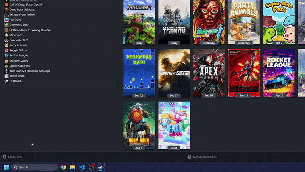
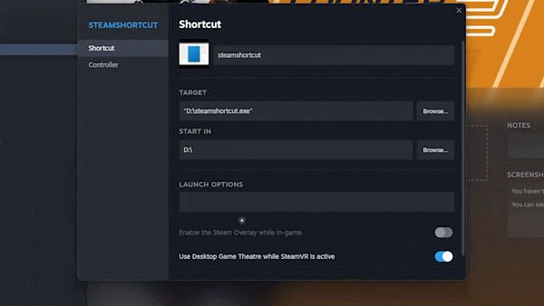
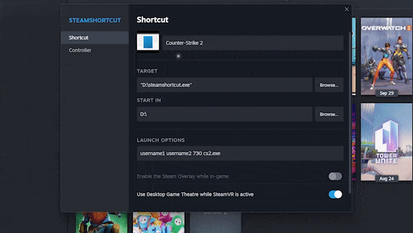
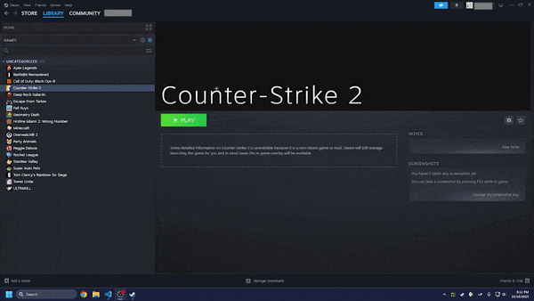
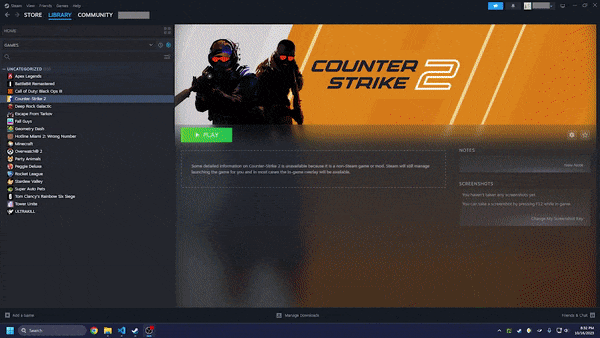

# Steam Shortcut
Create a shortcut to a Steam game that is in the library of another user. When the game is closed, Steam will log back into the original account. Effectively "evade" a ban by opening a shortcut to the game on a banned account.

Works by using [command line options](https://developer.valvesoftware.com/wiki/Command_line_options#Steam) to launch Steam ("-login" and "-applaunch" specifically).

## Example Usage

**Not raw footage, loading times are shortened.*

## Setup
### Adding the shortcut to Steam
   1) Add steamshort.exe as a non-Steam game.
   

   2) Right-click on the application in your Steam library and open "Properties."
   3) Enter launch options: `<mainAccountUsername> <targetAccountUsername> <steamAppID> <processName>`. Where \<mainAccountUsername> is the username of the current Steam account, \<targetAccountUsername> is the username of the account that owns the game you would like to launch. You can find the \<appID> in the URL of the Steam store page `store.steampowered.com/app/<appID>/<title>` and the \<processName> by using Task Manager. For Counter-Strike 2 the appID is `730` and the process name is `cs2.exe`. Also keep in mind that username is different from profile name. To get your username, view your account details.
   

### Disguising the shortcut as the game (Optional)
1) Right-click on the game (not the shortcut), click "Manage>Hide this game."
2) Source artwork for your game from [SteamGridDB](https://www.steamgriddb.com/). Counter-Strike 2 artwork is available in [this repo](https://github.com/jblsp/steamshortcut/tree/main/cs2_artwork).
3) Open the "Properties" window of the shortcut.
4) Change the title and double-click the shortcut icon to change it.

5) Right-click the games title and background to change/adjust them.

6) Open the grid view for your games, right click on the shortcut, and add the cover art.
